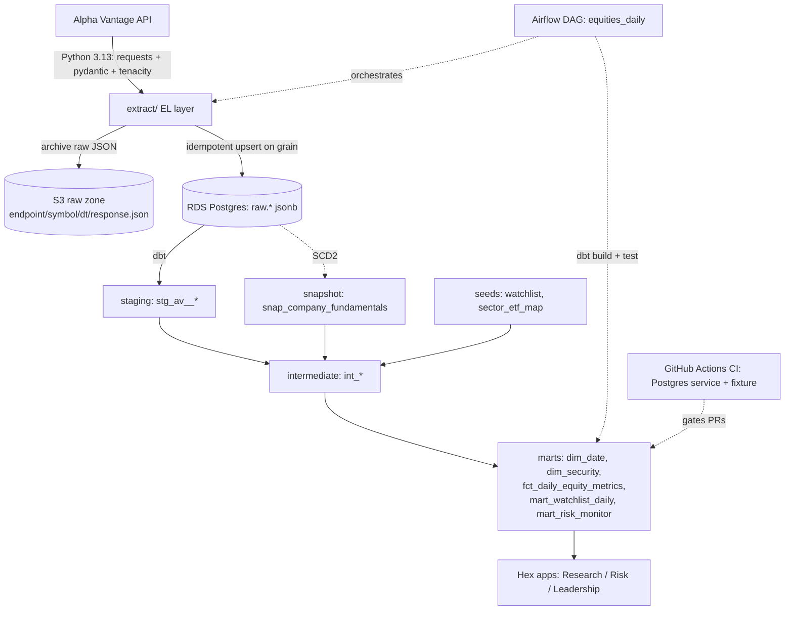
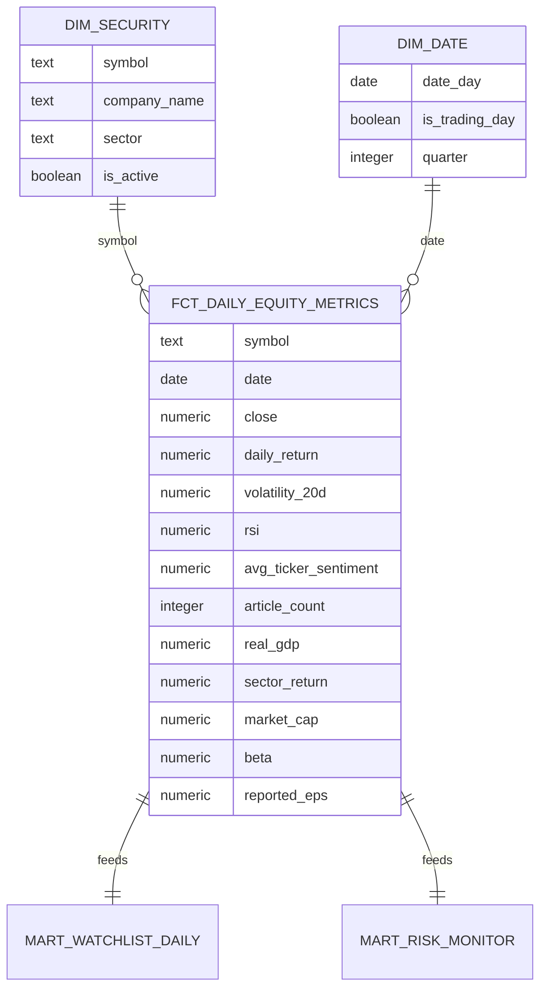
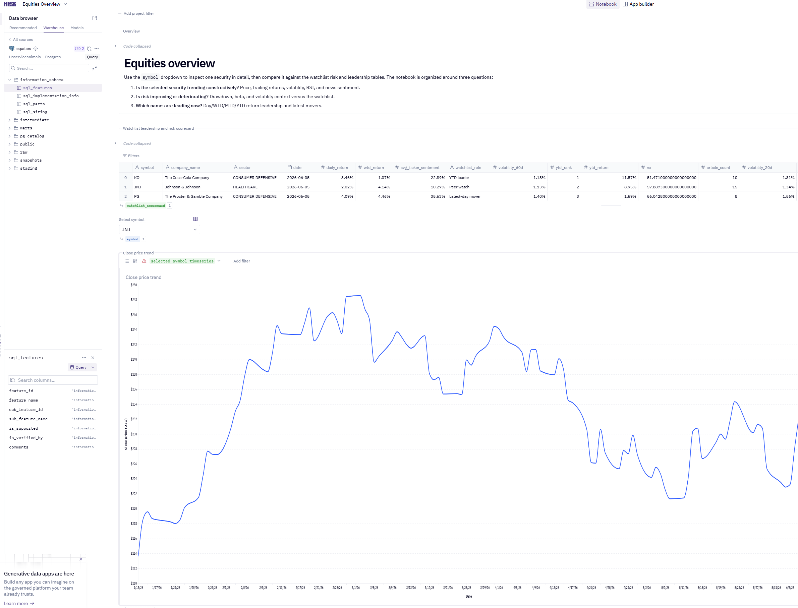

# Equities Analytics Platform

[](https://github.com/JoshuaPhillips64/Analytics-Platform-Demo/actions/workflows/ci.yml)

An end-to-end analytics pipeline that ingests equities data from **Alpha Vantage**, archives it on **S3**, loads it into **Postgres on RDS**, transforms it into tested, documented, **point-in-time-correct** data models with **dbt Core**, orchestrates with self-hosted **Airflow**, ships on GitHub with free **CI**, and serves three cross-functional teams through **Hex**.

The headline deliverable is **`marts.fct_daily_equity_metrics`** — one row per security per trading day, enriched with prices, returns, technicals, point-in-time fundamentals, daily sentiment, macro context, sector performance, and latest earnings — typed, contract-enforced, tested, and documented.

---

## Why this project

It demonstrates the full analytics-engineering loop with the discipline that separates a hobby script from a production pipeline:

| Capability | Where it shows up |
|---|---|
| Multi-step ETL/ELT | Python extract → S3 archive → RDS raw load → dbt staging → intermediate → marts, gated end to end |
| dbt modelling | Layered project: sources, staging, intermediate, snapshots, seeds, marts, tests, contracts, docs |
| Orchestration | Self-hosted Airflow DAG (`extract → freshness → snapshot → build → notify`) that halts on a failed test |
| Version control + CI | Public repo, GitHub Actions running lint + `dbt build` (every model **and** test) on a Postgres service container; branch protection |
| BI for cross-functional teams | Three Hex apps (Research, Risk, Leadership) reading `marts.*` only |

---

## Architecture



- **S3 is the immutable raw archive / replay source.** dbt-postgres transforms data *inside* RDS, so raw is loaded into RDS for dbt to run SQL against; S3 keeps the verbatim API responses for replay.
- **raw.* tables land verbatim JSON** keyed on the natural grain (e.g. `(symbol, date)`) with `record jsonb` + `source_s3_key` + `loaded_at`. Python does zero transformation — field naming and typing happen in dbt staging.

---

## Design decisions 

1. **Clean EL / ELT split.** Python only extracts and loads raw data; *all* cleaning, joining, aggregation, and typing live in dbt SQL. The old pipeline transformed in pandas and `to_sql(if_exists='replace')` — untestable and unversioned.
3. **Point-in-time correctness (the look-ahead-bias fix).** Fundamentals are captured as an **SCD2 snapshot** (`snap_company_fundamentals`) and joined **as-of** each trading date (`valid_from`/`valid_to`). A test (`assert_pit_fundamentals_no_overlap`) proves windows never overlap. Dates before the first snapshot capture get `NULL` fundamentals **by design** — we never back-stamp current values onto the past.
4. **Layering discipline.** `marts` never reference `staging`/`sources` directly — always through `intermediate` or dims. Enforced and verified against the dbt manifest.
5. **Idempotent, incremental loads.** Raw loads upsert on the grain; `fct_daily_equity_metrics` is incremental (`delete+insert` on `(symbol, date)`). Re-running a day is safe and produces zero duplicates.
6. **Contracts on the fact + dims** so a schema change can't silently break downstream BI.
7. **Reference data in version control.** The sector→ETF mapping is a dbt seed (`sector_etf_map.csv`).

---

## Data model

`fct_daily_equity_metrics` — grain **`(symbol, date)`**, contract-enforced, incremental:



Layers: `staging` (views, 1:1 with sources) → `intermediate` (returns, pivoted technicals, daily sentiment, forward-filled macro, point-in-time fundamentals, sector performance, reported earnings) → `marts` (dims as tables, fact as incremental). See `dbt docs generate` for full lineage.

---

## Testing & data quality

Every model has a **documented grain and at least one test**; `dbt build` runs models **and** tests, and a phase isn't done until they're green.

- **Generic:** `not_null` + `unique`/`dbt_utils.unique_combination_of_columns` on every grain; `relationships` fact→`dim_security` and fact→`dim_date`; `accepted_values` on indicator/report_type/sector.
- **Ranges (`dbt_expectations`):** RSI 0–100, `close > 0`, `dividend_yield >= 0`, `article_count >= 0`.
- **Singular:** `assert_high_low_consistency`, `assert_no_future_dates`, `assert_no_fabricated_sentiment`, `assert_pit_fundamentals_no_overlap`.
- **Contracts** on `fct_daily_equity_metrics`, `dim_date`, `dim_security`.
- **Source freshness:** warn 36h / error 72h on `av_daily_prices`.
- **Python:** `pytest` for the EL layer (client retry/backoff, schema validation, decomposition, idempotency); `ruff` + `black`; `sqlfluff` for SQL.

CI re-runs lint + the full `dbt build` (every model and test) on a Postgres service container for every PR.

---

## Data scope

This build runs on the **free** Alpha Vantage tier, which shapes the dataset. Everything is config-driven, so moving to premium is a one-line `.env` change (`AV_PRICES_FUNCTION`, `AV_PRICES_OUTPUTSIZE`, `AV_REQUESTS_PER_MINUTE`) plus a re-run — no code changes.

| | Free tier (current) | Premium |
|---|---|---|
| Active symbols | KO, JNJ, PG (+ seeded, inactive: 9 more) | full ~22-symbol universe |
| Prices | `TIME_SERIES_DAILY`, non-adjusted, ~100 days (`compact`) | `TIME_SERIES_DAILY_ADJUSTED`, full history |
| Technicals | RSI loaded; MACD/ADX/BBANDS modelled, awaiting load | all four |
| Sector/market | mapped; returns await sector-ETF + index prices | populated |

The architecture, models, tests, and lineage are unaffected by scope — only the breadth of data is. A daily-cap hit is treated as a *soft* skip so the scheduled DAG stays green.

---

## Run it

Prereqs: [`uv`](https://docs.astral.sh/uv/), Docker (for local Airflow), an Alpha Vantage key, and AWS (S3 + RDS) — see `infra/`.

```bash
# 1. Toolchain (Python 3.13 via uv) + deps
uv python install 3.13 && uv sync --extra dev --extra dbt
cp .env.example .env            # fill in AV key, S3 bucket, RDS creds

# 2. Python EL: extract -> S3 -> RDS raw (idempotent)
uv run python -m extract.run_extract --symbols KO,JNJ,PG --endpoints prices,news,economic
uv run pytest extract/tests -q

# 3. dbt: build + test everything  (from transform/, with .env exported)
cd transform && dbt deps && dbt build        # runs models AND tests
dbt docs generate && dbt docs serve          # lineage + docs

# 4. Orchestration: self-hosted Airflow (LocalExecutor)
cd orchestration && cp .env.example .env
docker compose build && docker compose up airflow-init && docker compose up -d
#   UI at http://localhost:8080 (admin/admin); or run once headless:
docker compose run --rm airflow-cli airflow dags test equities_daily
```

- **AWS infra** is Terraform (`infra/terraform/`): S3 + RDS `db.t4g.micro` + EC2 `t3.small` + IAM role + $ budget alert, in a dedicated NAT-free VPC. See `infra/README.md`. **Stop RDS/EC2 when idle.**
- **CI / branch protection** setup: see `.github/CI_SETUP.md`.


---

## BI dashboards (Hex)

Three Hex Community apps read `marts.*` only (governance story). Setup + the exact queries each app uses are in **[`docs/bi_hex.md`](docs/bi_hex.md)**.

1. **Research / Analyst** — single-security deep dive (param `symbol`): price + RSI, returns, latest PIT fundamentals, recent earnings, sentiment trend.
2. **Risk** — watchlist risk monitor: rolling vol, beta, max drawdown, distance from 52-week high (`mart_risk_monitor`).
3. **Leadership** — watchlist performance: Day/WTD/MTD/YTD returns, top movers, sentiment snapshot (`mart_watchlist_daily`).



---

## Repo layout

```
extract/         Python 3.13 EL (Alpha Vantage client, schemas, endpoints, S3 archive, RDS raw load, CLI, tests)
transform/       dbt Core project (sources, staging, intermediate, snapshots, seeds, marts, tests, macros)
orchestration/   self-hosted Airflow (docker-compose LocalExecutor + equities_daily DAG)
infra/           Terraform (S3 + RDS + EC2 + IAM + budget) and the DB bootstrap
.github/         GitHub Actions CI (Postgres service + committed fixture) + setup docs
docs/            PROJECT_SPEC.md (source of truth) + BI guide
```
